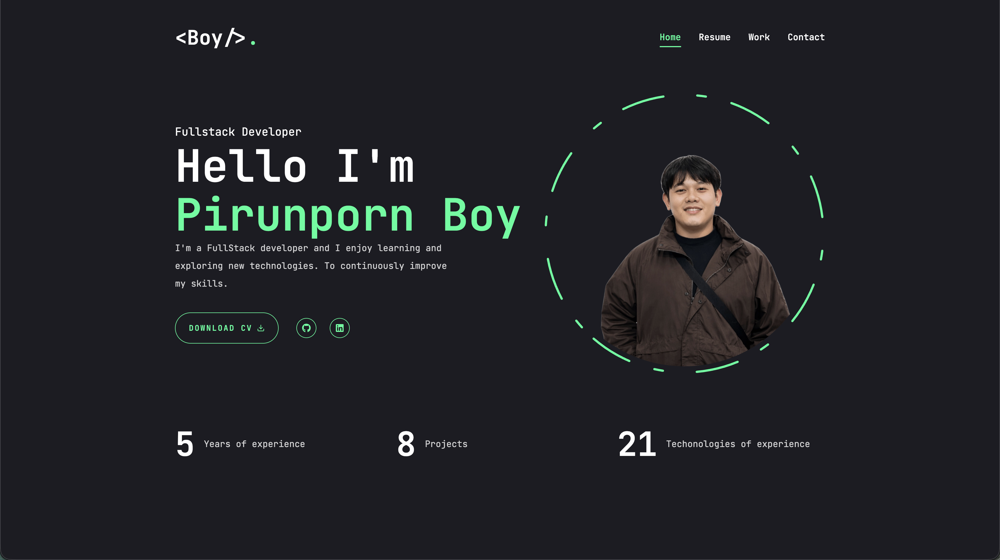

# Portfolio Website

This is a personal portfolio website developed using **Next.js** and **TailwindCSS**. The website showcases my skills, projects, and provides a contact form for communication.

## 🚀 Features

- 📱 **Fully Responsive**: The website is designed to be mobile-friendly, responsive across tablets and desktops.
- 🧑‍💻 **Showcase of Projects**: View a variety of projects I have worked on, with detailed descriptions and images.
- 🏆 **Skills**: Learn more about the technologies I specialize in.
- 📧 **Contact Form**: Reach out to me through the built-in contact form to discuss potential collaborations or inquiries.
- 🌐 **Social Media Links**: Easily navigate to my LinkedIn, GitHub, and other profiles to stay connected.
- 🔝 **Scroll to Top Button**: Quickly return to the top of the page with just a click.
- ⚡ **Smooth Animations**: Hover and scroll animations add an interactive and engaging touch to the experience.


## ⚙️ Technologies Used

- **Next.js** - Framework for building React applications.
- **TailwindCSS** - Utility-first CSS framework for styling.
- **Framer Motion** or **TailwindCSS Animations** - For smooth animations.

### 📸 Preview

<div style='display:"flex";flex-direction:"row";flex-wrap:"wrap" gap:"2rem"'>
  <a href="https://portfolio-pirunporns-projects.vercel.app/">
    
  </a>
</div>

## 🌍 Visit My Portfolio

You can visit my live portfolio at [Portfolio](https://portfolio-pearl-psi-31.vercel.app/)


### 🛠️ Technologies Used

- **Frontend:** 📱 NextJs Tailwindcss Framer motion

### 🔧 Installation

1. Clone the repository:
   ```sh
   git clone https://github.com/boypirunporn/portfolio.git  
   ```
2. Navigate to the project folder:
   ```sh
   cd portfolio  
   ```
3. Install dependencies:
   ```sh
   npm install
   or
   yarn  
   ```
4. Start the development server:
   ```sh
   npm run dev
   or
   yarn start  
   ```
